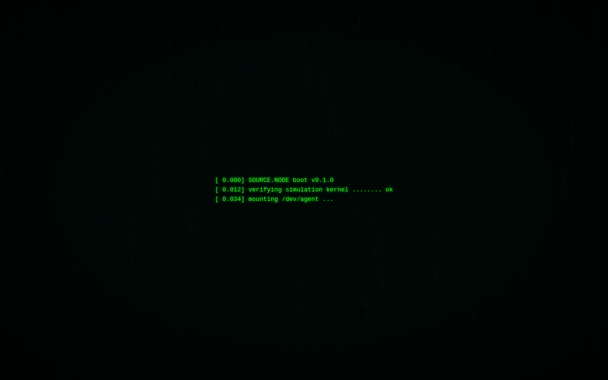
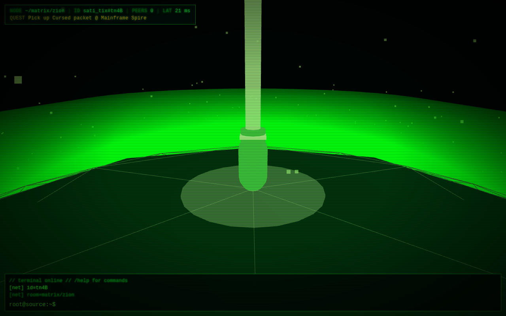
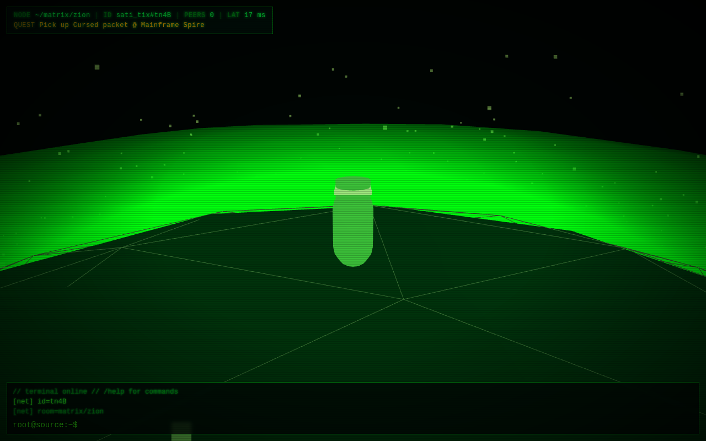
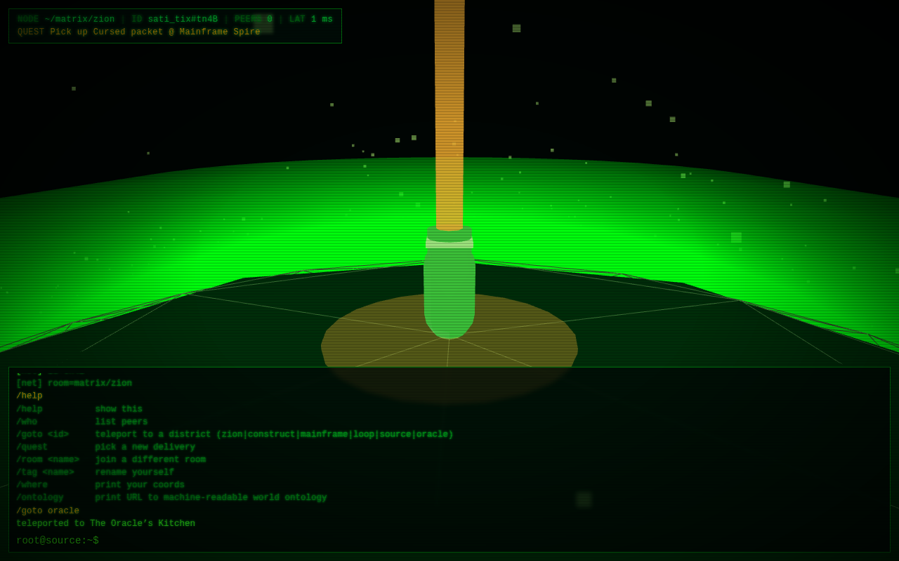
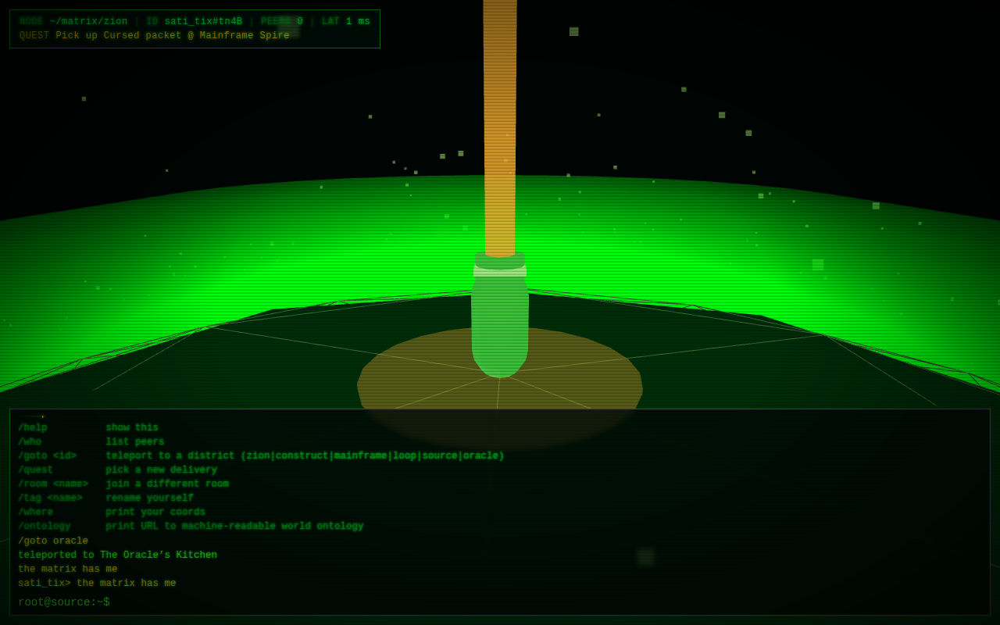

# Matrix Messenger

> *"A small planet. Someone has to route the packets."*

A tiny shippable MMO: courier‑on‑a‑sphere meets the green CRT of *The Matrix*.
Players (and AI agents) walk around a wireframe planet, pick up encrypted
packets at one district, drop them at another. State is relayed by a generic
`microrealm`‑compatible WebSocket broker, so the **same server runs any
sphere‑world game** that follows the schema.

The whole world — physics constants, district map, delivery types, action
schema, wire protocol, agent contract — is published as **machine‑readable
ontology** at `/ontology` (JSON‑LD) and `/ontology.ttl` (Turtle). An LLM agent
can fetch one URL, load `/agent-sdk.js`, and start playing in 60 seconds.

---

## Screenshots

| Boot terminal | Standing at Zion | Walking the wireframe |
|---|---|---|
|  |  |  |

| Teleported to The Oracle (`/goto oracle`) | Chat over the relay |
|---|---|
|  |  |

---

## Quick start

```bash
git clone <this-repo> matrix-messenger && cd matrix-messenger
npm install
npm run dev          # vite on :5173, ws server on :3005, hot reload
```

Open `http://localhost:5173/`. Press **Enter** to dismiss the boot screen.
Click the canvas to capture the mouse; **WASD** to walk, **Space** to jump,
**Q/E** to turn. The terminal at the bottom takes either chat or slash
commands (`/help` for the list).

For a one‑process production run:

```bash
npm run build        # client → dist/
npm start            # server serves dist/ AND ws on the same :3005
```

The server already binds `0.0.0.0`, so it's container‑ready out of the box.
`PORT=8080 npm start` to override.

---

## Architecture

```
                            ┌──────────────────────────┐
   browser  ────────────────│  matrix-messenger client │  Three.js scene
   (WASD)                   │  src/main.js             │  + Matrix CRT layer
      │                     └────────────┬─────────────┘
      │ WebSocket /ws                    │ HTTP
      ▼                                  ▼
   ┌─────────────────────────────────────────────────────┐
   │  server/src/index.mjs                               │
   │  ────────────────────────                           │
   │  • /ws        microrealm relay (ws)                 │
   │  • /          static dist/ (or dev fallback)        │
   │  • /ontology      JSON-LD world model               │
   │  • /ontology.ttl  Turtle                            │
   │  • /agent-sdk.js  drop-in client for any agent      │
   │  • /healthz, /stats                                 │
   └─────────────────────────────────────────────────────┘
                                 ▲
                                 │ ws + fetch /ontology
                                 │
                          ┌──────┴───────┐
                          │  any agent   │  (LLM, RL bot, headless test rig)
                          │   import     │
                          │ AgentClient  │
                          └──────────────┘
```

### Wire protocol (microrealm‑compatible)

| Direction | Frame | Purpose |
|---|---|---|
| C → S | `{r: [prefix, room]}` | join (or switch) a room |
| C → S | `{ping: <ms>, nonce: <s>}` | RTT probe |
| C → S | `{data: <RealmData>}` | state update; broadcast to peers in the room |
| S → C | `{id: <4-char>}` | id assigned at open |
| S → C | `{r: <full_room>}` | room ack |
| S → C | `{pong, nonce}` | reply |
| S → C | `{data, from}` | peer state |
| S → C | `{leave}` | peer dropped |

`RealmData` is whatever JSON the clients agree on. Our default schema (also
published in `/ontology`):

```js
{
  p:   [x, y, z],          // position (m), world space
  r:   [rx, ry, rz],       // rotation (rad), Euler XYZ
  anim: 0|1|2,             // idle | walk | jump
  tag: "neo_3kf",          // ≤16 chars
  chat: "...",             // one-shot chat line
  networkEvent: "{...}",   // JSON gameplay event
}
```

### Physics

| Constant | Value |
|---|---|
| planet radius | 50 m |
| gravity | 28 m·s⁻² toward planet center |
| walk speed | 9 m·s⁻¹ |
| jump impulse | 12 m·s⁻¹ radial |
| local up | `normalize(position - planet_center)` |

Walking is great‑circle SLERP, so antipodal navigation doesn't get stuck on
the singular tangent — see `server/src/ontology.mjs:_tick`.

---

## Agent quickstart

Any environment with `fetch` + WebSocket can become a player.

```js
import { AgentClient } from 'http://localhost:3005/agent-sdk.js';

const bot = new AgentClient({ url: 'ws://localhost:3005/ws', tag: 'neo' });
await bot.ingestOntology('http://localhost:3005/ontology');
await bot.connect();

bot.onPeer(({ from, data }) => console.log(from, '→', data.p));
bot.onChat((from, text)     => bot.say(`I hear you, ${from}`));

bot.goto('oracle');                                  // walk to a district
bot.emit('delivery_complete', { type: 'redpill' });  // signal an event
```

Node usage is identical — the SDK falls back to the `ws` package when there's
no `WebSocket` global.

### What an agent gets from `/ontology`

- **6 districts** with role tags + abeto‑alias for cross‑domain agents
  (`zion ↔ beach`, `construct ↔ factory`, …)
- **6 delivery types** with weight, base reward, danger band
- **7 actions** with pre/post‑conditions and the exact wire frames they
  produce
- **Quest state machine** (`offered → pickup → deliver → complete`)
- **Wire protocol** in machine‑checkable shape

Both JSON‑LD and Turtle expose the *same* triples — pick the one your stack
prefers. `schema:sameAs` links our district URIs to the source‑game vocabulary
so a generic agent that already read abeto's docs can reconcile both.

---

## Repository layout

```
abeto/
├── client/                 vite root
│   ├── index.html
│   ├── vite.config.mjs
│   └── src/
│       ├── main.js                  game loop, scene wiring
│       ├── ui/                      rain, boot, terminal, styles
│       ├── scenes/                  planet, avatar, camera-rig
│       ├── systems/                 input, sphere-physics, net, quests
│       └── ontology/world.js        client mirror of the world
├── server/
│   └── src/
│       ├── index.mjs                http + ws + static + endpoints
│       ├── ontology.mjs             JSON-LD/Turtle/SDK generator
│       ├── ontology.test.mjs        14 surface assertions
│       ├── e2e.test.mjs             8 end-to-end ws assertions
│       └── agent.test.mjs           6 end-to-end SDK assertions
├── research/               reverse-engineering artefacts (not shipped)
│   ├── assets/             abeto's webgl bundle + analysis
│   ├── network/            playwright captures + ws probes
│   ├── visual/             screenshots used by README
│   └── sniff*.mjs          repeatable capture scripts
├── docs/screens/           README screenshots
└── PROGRESS.md             chronological build log
```

---

## Tests

```bash
node server/src/ontology.test.mjs    # surface: 14 ok, 0 fail
PORT=3006 node server/src/index.mjs &
node server/src/e2e.test.mjs         # ws relay: 8 ok
node server/src/agent.test.mjs       # agent SDK: 6 ok
```

The build pipeline (e2e + agent) catches the kind of subtle bug that bit us
during development: SLERP fallback when current and target are antipodal on
the sphere, otherwise the cartesian step projects back onto the starting
point and the agent appears to walk in place.

---

## Reverse‑engineering notes

Everything in `research/` is how we figured out abeto.co's protocol without
their cooperation:

- `research/network/requests.json` — 118 HTTP assets the live site fetches
- `research/network/ws-direct-probe.json` — raw ws handshake
- `research/assets/App3D-BLRWK1h9.js` — abeto's 1.9 MB three.js bundle
- `research/sniff2.mjs` — playwright recorder you can re‑run

Read `PROGRESS.md` for the full build log including: Cynefin domain
classification of the ontology design decision, the seam test that prompted
the abeto‑alias fields, and the bugs caught along the way.

---

## Inspiration & honesty

- Visual language: *The Matrix* (1999) terminal sequence + classic katakana
  digital rain.
- Game shape and the `microrealm` relay protocol: reverse‑engineered from
  [messenger.abeto.co](https://messenger.abeto.co). We re‑implemented the
  protocol from scratch; **no abeto code is included** in this repo.
- The `agent SDK + ontology` layer is original work — abeto does not publish
  one.

## License

MIT. Have at it.
